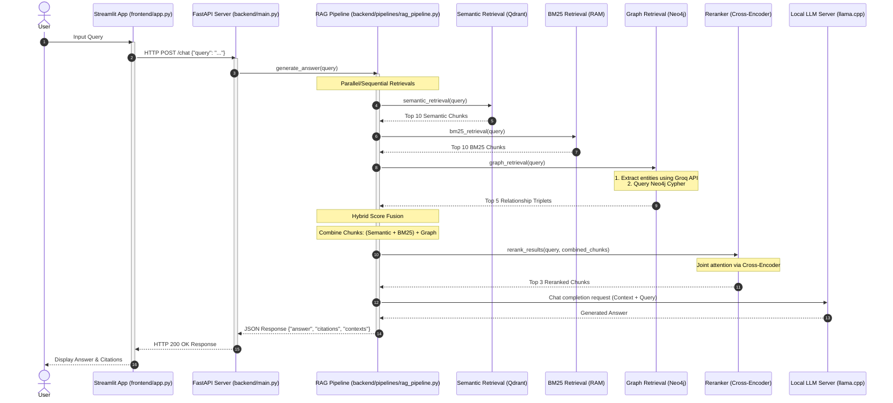

# Project Explanation: Runtime Query Execution Flow

This document details the step-by-step technical execution flow of the Hybrid GraphRAG system when a user submits a query. It focuses on the **Query Stage** (runtime execution), explaining how data flows from the user interface down to the retrieval components, reranking, and generation.

For details on the offline data preparation, chunking, and database ingestion, refer to [things_to_know.md](file:///d:/projects/graph_rag/things_to_know.md).

---

## High-Level Runtime Architecture

Below is a sequence chart illustrating how a query travels through the system:



---

## Detailed Step-by-Step Flow

### 1. Frontend Interaction
* **File:** [app.py](file:///d:/projects/graph_rag/frontend/app.py)
* **Mechanics:** 
  The entry point is a Streamlit application. The user types a question into a text input widget:
  ```python
  query = st.text_input("Ask a Question")
  ```
  Upon submission, Streamlit initiates an HTTP POST request to the FastAPI backend API endpoint `/chat` on port 8000 using `httpx.post`.
  * **Payload:** `{"query": "<user_query>"}`
  * **Timeout:** Set to `60.0` seconds to accommodate deep retrieval, network calls to Groq, and local LLM generation.

---

### 2. Backend Entry Point
* **File:** [main.py](file:///d:/projects/graph_rag/backend/main.py)
* **Mechanics:**
  The FastAPI application receives the HTTP request at the `/chat` route. 
  1. The request payload is validated against a Pydantic schema:
     ```python
     class QueryRequest(BaseModel):
         query: str = Field(min_length=1)
     ```
  2. The validated query is forwarded to the main execution pipeline:
     ```python
     result = await generate_answer(request.query, bm25_index, documents)
     ```
     *(Note: `bm25_index` and `documents` are global objects loaded in memory during FastAPI's startup lifespan event).*

---

### 3. Pipeline Coordination: `generate_answer`
* **File:** [rag_pipeline.py](file:///d:/projects/graph_rag/backend/pipelines/rag_pipeline.py)
* **Mechanics:**
  This function orchestrates the three distinct retrieval pathways, merges their results, routes them through a reranking model, and invokes the final LLM generator.

---

### 4. The Three Retrieval Pipelines

Once inside the pipeline, the system initiates three retrieval runs to collect evidence for the query:

#### A. Semantic Retrieval (Dense Vector Search)
* **File:** [semantic_retrieval.py](file:///d:/projects/graph_rag/backend/retrievals/semantic_retrieval.py)
* **Underlying Concept:** Dense retrieval represents text as numerical vectors in a continuous space where distance corresponds to semantic similarity.
* **Process:**
  1. The user's text query is converted into a 768-dimensional vector embedding using the same model configured during document ingestion: `sentence-transformers/all-mpnet-base-v2`.
  2. A vector query is sent to Qdrant using the async Qdrant client:
     ```python
     results = await qdrant_client.query_points(
         collection_name=COLLECTION_NAME,
         query=query_embedding,
         limit=10,
     )
     ```
  3. Qdrant performs a fast vector search (typically utilizing HNSW graphs) and returns the top 10 matching document chunks with their respective cosine similarity scores.

#### B. Keyword Retrieval (Sparse Lexical Search)
* **File:** [bm25_retrieval.py](file:///d:/projects/graph_rag/backend/retrievals/bm25_retrieval.py)
* **Underlying Concept:** Lexical retrieval relies on word-frequency statistics. We use the **BM25 (Best Match 25)** formula, which ranks documents based on the occurrences of query terms in each document, adjusted for document length.
* **Process:**
  1. The query string is normalized and tokenized into words: `query.lower().split()`.
  2. The query tokens are evaluated against the BM25 index pre-computed during server startup:
     ```python
     scores = bm25_index.get_scores(tokenized_query)
     ```
  3. The index ranks all document texts based on TF-IDF-like statistics.
  4. The top 10 text chunks with the highest lexical match scores are returned.

#### C. Knowledge Graph Retrieval (Relational Search)
* **File:** [graph_retrieval.py](file:///d:/projects/graph_rag/backend/retrievals/graph_retrieval.py) and [entity_extractor.py](file:///d:/projects/graph_rag/backend/entity_extractor.py)
* **Underlying Concept:** Normal vector search retrieves isolated text blocks. Knowledge Graph retrieval extracts structured facts (Entity $\rightarrow$ Relation $\rightarrow$ Entity) that connect disparate parts of a corpus, which is ideal for multi-hop reasoning.
* **Process:**
  1. **Entity Extraction:** The raw query is passed to an LLM (`llama-3.1-8b-instant` via the Groq API) with instructions to output a JSON list of key concepts in Title Case:
     ```python
     # Example: "How does Qdrant connect with FastAPI?" 
     # Returns: {"entities": ["Qdrant", "FastAPI"]}
     ```
  2. **Neo4j Graph Query:** The extracted entity list is utilized to execute a Cypher query on the Neo4j instance:
     ```cypher
     MATCH (source)-[r]->(target)
     WHERE source.name IN $entities OR target.name IN $entities
     RETURN source.name AS source, type(r) AS relationship, target.name AS target
     ```
  3. **Fact Structuring:** The query results are transformed into plain-language statements (e.g., `"FastAPI USED_WITH Qdrant"`) and tagged with a generic source `"graph"`. The pipeline takes the top 5 relationship statements.

---

### 5. Hybrid Retrieval Fusion
* **File:** [hybrid_retrieval.py](file:///d:/projects/graph_rag/backend/retrievals/hybrid_retrieval.py)
* **Underlying Concept:** Semantic scores (typically cosine similarities $[0, 1]$) and BM25 scores (open-ended positive values) are on completely different scales and cannot be compared or added directly.
* **Process:**
  1. **Min-Max Normalization:** Scores for both retrieval sets are normalized to a $[0.0, 1.0]$ range:
     $$\text{Normalized Score} = \frac{\text{Score} - \text{Min Score}}{\text{Max Score} - \text{Min Score}}$$
  2. **Score Aggregation:** The results are combined. If a document chunk is retrieved by both semantic and lexical searches, its normalized scores are summed:
     $$\text{Final Score} = \text{Normalized Semantic Score} + \text{Normalized BM25 Score}$$
     If it only appeared in one, the missing score is treated as $0.0$.
  3. **Trimming:** The fused results are sorted descending, and the top 5 chunks are selected.
  4. **Graph Context Appending:** The top 5 hybrid text chunks are combined with the top 5 relational triplets from the Graph Retrieval.
     ```python
     retrieved_chunks = hybrid_results + graph_results
     ```

---

### 6. Cross-Encoder Reranking
* **File:** [reranker.py](file:///d:/projects/graph_rag/backend/retrievals/reranker.py)
* **Underlying Concept:** 
  Standard vector retrievers are **Bi-encoders**—they embed the query and the documents separately, allowing fast vector comparisons but missing fine-grained cross-token attention. 
  A **Cross-encoder** feeds the query and document *together* into the transformer model, allowing self-attention layers to compute interactions between every query word and every document word. This is computationally heavier but significantly more accurate.
* **Process:**
  1. The pipeline feeds pairs of `(query, chunk_text)` to the `CrossEncoder("BAAI/bge-reranker-base")`.
  2. The cross-encoder predicts a relevance score for each pair.
  3. The combined collection of 10 contexts is re-sorted according to the reranker scores.
  4. The top 3 highest-scoring chunks are kept for prompt generation.

---