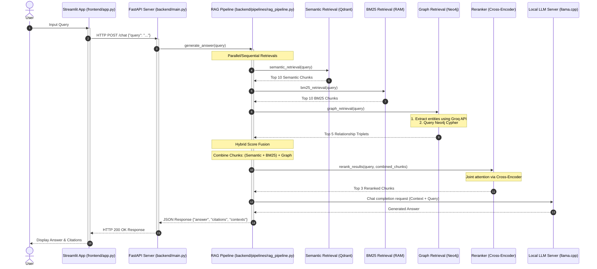

# Project Explanation: Runtime Query Execution Flow

This document details the step-by-step technical execution flow of the Hybrid GraphRAG system when a user submits a query. It focuses on the **Query Stage** (runtime execution), explaining how data flows from the user interface down to the retrieval components, reranking, and generation.

For details on the offline data preparation, chunking, and database ingestion, refer to [things_to_know.md](file:///d:/projects/graph_rag/things_to_know.md).

---

## High-Level Runtime Architecture

Below is a sequence chart illustrating how a query travels through the system:



---

## Detailed Step-by-Step Flow

### 1. Frontend Interaction
* **File:** [app.py](file:///d:/projects/graph_rag/frontend/app.py)
* **Mechanics:** 
  The entry point is a Streamlit application. The user types a question into a text input widget:
  ```python
  query = st.text_input("Ask a Question")
  ```
  Upon submission, Streamlit initiates an HTTP POST request to the FastAPI backend API endpoint `/chat` on port 8000 using `httpx.post`.
  * **Payload:** `{"query": "<user_query>"}`
  * **Timeout:** Set to `60.0` seconds to accommodate deep retrieval, network calls to Groq, and local LLM generation.

---

### 2. Backend Entry Point
* **File:** [main.py](file:///d:/projects/graph_rag/backend/main.py)
* **Mechanics:**
  The FastAPI application receives the HTTP request at the `/chat` route. 
  1. The request payload is validated against a Pydantic schema:
     ```python
     class QueryRequest(BaseModel):
         query: str = Field(min_length=1)
     ```
  2. The validated query is forwarded to the main execution pipeline:
     ```python
     result = await generate_answer(request.query, bm25_index, documents)
     ```
     *(Note: `bm25_index` and `documents` are global objects loaded in memory during FastAPI's startup lifespan event).*

---

### 3. Pipeline Coordination: `generate_answer`
* **File:** [rag_pipeline.py](file:///d:/projects/graph_rag/backend/pipelines/rag_pipeline.py)
* **Mechanics:**
  This function orchestrates the three distinct retrieval pathways, merges their results, routes them through a reranking model, and invokes the final LLM generator.

---

### 4. The Three Retrieval Pipelines

Once inside the pipeline, the system initiates three retrieval runs to collect evidence for the query:

#### A. Semantic Retrieval (Dense Vector Search)
* **File:** [semantic_retrieval.py](file:///d:/projects/graph_rag/backend/retrievals/semantic_retrieval.py)
* **Underlying Concept:** Dense retrieval represents text as numerical vectors in a continuous space where distance corresponds to semantic similarity.
* **Process:**
  1. The user's text query is converted into a 768-dimensional vector embedding using the same model configured during document ingestion: `sentence-transformers/all-mpnet-base-v2`.
  2. A vector query is sent to Qdrant using the async Qdrant client:
     ```python
     results = await qdrant_client.query_points(
         collection_name=COLLECTION_NAME,
         query=query_embedding,
         limit=10,
     )
     ```
  3. Qdrant performs a fast vector search (typically utilizing HNSW graphs) and returns the top 10 matching document chunks with their respective cosine similarity scores.
